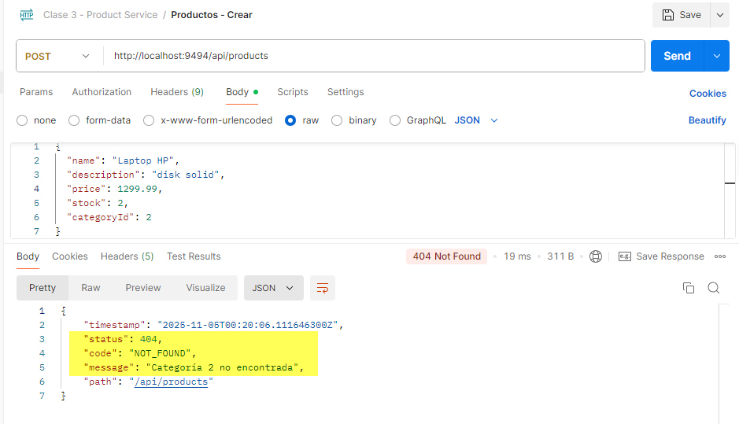

# Tarea 3 · Refuerzo de arquitectura, validaciones y relación 1:N

## Objetivo
Consolidar el product-service aplicando las buenas prácticas vistas en clase: capas bien definidas, DTOs validados, manejo uniforme de errores y categorías persistidas.

## Pasos
1. Levantar Docker Compose (docker compose up -d)  
2. Crear categorias, relación 1:N producto-categoria
3. Prueba de validaciones-casos de error (400, 404, 409)
4. Prueba de endpoints con Postman (capturas en screenshot/).

## Resultado

### Crear categorias, relación 1:N producto-categoria

POST http://localhost:9494/api/categories crea categoria

POST http://localhost:9494/api/products crea producto-categoria

### Validaciones casos de error - pruebas

ERROR 400 (precio negativo)

ERROR 404 (categoria no existe)

ERROR 409 (categoria duplicada)

## Autor
Judith Quelca - Curso Spring Boot & Kafka